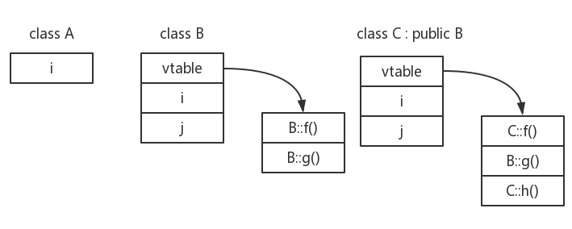

# 5th_week
[TOC]

## 继承 Inheritance
1. 在`3rd_week`中，我们学习了一种**软件重用**的方法--对象组合，即`封闭类`。而`继承`就是另一种**软件重用**的方法。  
    |   软件重用方式  |     |
    | :-- | :-- |
    |   继承  |   拿类进行“改造”得到新的**类**  |
    |   对象组合  |   拿具体的类的对象拼出**新对象**  |
2. 语法：`class B : public A {...};`
3. C++11提供了一种防止继承的关键字`final`。
    ```C++
    //A不能被继承。
    class A final{
        ...
    };
    ```
    同时，`final`还可以用于**函数**。如果一个函数被定义成`final`，那么之后任何尝试覆盖
3. :star:在C++中，**基类**必须将它的两种成员函数区分开来：
    1. 基类希望子类进行`覆盖(override)`的函数；
    2. 基类希望子类直接继承而不要改变的函数。
4. 下面根据`class B : public A`，即A为父类，B为子类，来讲一些Tips。
    1. 若A没有默认构造函数（default constructor），则B**必须**在其构造函数的**初始化列表**中，初始化A的构造函数。利用初始化列表，可以避免子类无法访问基类`private`成员导致无法在函数体中初始化的情况。 
        ```C++
        class A
        {
            int i;
            int j;
        public:
            //A没有默认构造函数，只有自己写的一个构造函数。
            A(int num) : i(num) {}
        };

        class B : public A
        {
        public:
            //记住要把A的构造函数放入初始化列表，下面两个例子均可。
            B() : A(1) {}
            B(int num) : A(num) {}
        };
        ```
    2. 构造时，先构造A，再构造B；析构时，先析构B，再析构A。
    3. 若B含有有A中函数的`overwrite`重写（重定义），则A中同名函数会被`name hiding`，但可以使用作用域运算符`A::func()`来强制使用A中的同名函数。下面是一个简单例子。
        > :exclamation:这么一种name hiding的方式，似乎在所有OOP语言中，只有C++这么做。
        > C++认为，被name hiding的函数与重载函数一点关系没有，而像Java会将它们视为`override`覆盖的关系。  
        > 在C++中，在子类的成员函数中使用override时，如果基类中无此函数，或基类中的函数并不是虚函数，编译器会给出相关错误信息。

        ```C++
        class A
        {
        public:
            void printShit(){cout<<"from A."<<endl;}
        };

        class B : public A
        {
        public:
            void printShit(){cout<<"from B."<<endl;}
        };
        int main()
        {
            B b;
            b.printShit();
            b.A::printShit();
        }

        输出：
        from B.
        from A.
        ```
        > 如果在这里产生疑问：此处，参数表相同，这两个函数是~~重载~~overwrite重定义关系吗？那么应该回顾一下`3rd_week`的`this`指针内容。:snail:  

        不止成员函数，子类的**成员**（包括变量、函数等）也将隐藏**同名**的**基类成员**。

5. 谈谈三个概念。
    1. `Overload` 重载  
        1. 首先应该明确，只有在**同一个作用域**内（比如一个类中），才有重载的说法。
        2. 函数名字相同，但形参不同（类型、数量），从而形成重载关系。
        3. **不允许**出现，函数名字相同、形参相同，只有返回值类型的情况。
            ```C++
            void printShit(){cout<<"from A."<<endl;}
            bool printShit(){return true;}//ERROR!!!
            ```
        4. 顶层const做形参不影响传入函数的对象，故无法做区分。  
            底层const做形参可以区分某些类型的指针（引用）：它们是指向某些类型的指针（引用），还是指向常量的指针（引用）。
            > 在IDE中写形参为顶层const的成员函数，会发现编译器是把它的形参当作没有const，因为顶层const完全不影响我接受的对象是否为常量，故会有第一条结论。  
            > `void printShit(const int a){}`

    2. `Override` 覆盖
        1. 覆盖指的是，子类对从基类继承来了的旧定义进行重新定义。
        2. 一般会在基类中定义`虚函数(virtual)`，作为基类希望子类进行`覆盖`的函数。:star:`override`的对象必须是基类的`虚函数`。
        3. C++11提供了关键字`override`，来让子类**显式地**注明它使用此成员函数来覆盖它所继承的虚函数。
            > :star:此关键字是为了让编译器帮我们发现一些错误。  
            > 如果不使用此关键字，当我们在`覆盖`一个虚函数时参数表没有正确对应上，此时编译器会将此成员函数当作同名不同形参的新函数，是新定义的、独立的新函数，并且`name hiding`基类的同名函数。  
            > 如果采用了`override`关键字，那么编译器就会发现我们`覆盖`了一个并不存在的虚函数，从而发现错误。

            ```C++
            class A
            {
            public:
                virtual void printShit(){}
                void printShit(){cout<<"from A."<<endl;}
            }

            class B: public A
            {
                void printShit() override {cout<<"from B."<<endl;}
            }
            ```
        4. :star:如果基类中的虚函数有`overload`，那么在子类中进行`override`时，必须把所有基类的`overload`函数都`override`，否则会触发`name hiding`，子类对象无法使用没有`override`的虚函数。
    3. `Overwrite` 重写/重定义
        1. 其实这个概念**是否存在**是**有争议**的。我个人比较赞同的观点是：`overwrite`意指触发了`name hiding`，它与`overload`和`override`两个概念无法并列讨论。
        2. 如果基类中本身有对某一函数的重载，而在子类中对此同名函数`重写`时，会将所有的基类重载函数都`name hiding`。

---
## 向上造型 Upcasting
1. 指子类对象被当作基类对象看待。以下三种情况都是被允许的：（假设B继承于A）
    1. A = B
    2. A* = &B
    3. A& = B
2. 当进行`upcasting`时，此父类对象拥有与子类对象共有的部分。
3. `upcasting`会使基类的`name hiding`现象消失。


---
## 多态 Polymorphism
1. 多态是面向对象语言的特性之一。在C++中，谈到多态，总是会涉及到使用**指针**或者**引用**来调用一个成员函数。谈多态，就肯定肯定要先了解`虚函数`。
2. 虚函数
    1. 使用关键字`virtual`在类中定义一个函数为虚函数。
    2. `virtual`只需在声明时说明。
    3. :exclamation:若在基类的虚函数中的参数表使用`默认参数(default argument)`，那么会造成问题：子类`override`的函数中的默认参数会**失效**，其默认参数仍然是基类虚函数的默认参数。
        ```C++
        //假设这是基函数中的虚函数
        virtual void f(int i = 5){cout<<i<<endl;}

        //假设这是子类所override的函数
        void f(int i = 50){cout<<i<<endl;}
        ```
        调用子类的`f()`，会发现，其输出的`i`并不是50，而是5。这就是使用默认参数会出现的异常。
3. 可以通过下面这个例子看看虚函数的效果。
    ```C++
    class A
    {
    public:
        virtual void f(){cout<<"A"<<endl;}
        void g(){cout<<"A"<<endl;}
    };

    class B : public A
    {
    public:
        virtual void f(){cout<<"B"<<endl;}
        void g(){cout<<"B"<<endl;}
    };

    class C : public A
    {
    public:
        virtual void f(){cout<<"C"<<endl;}
        void g(){cout<<"C"<<endl;}
    };

    void f(A* p)
    {
        p->f();
    }

    void g(A& a)
    {
        a.g();
    }

    int main()
    {
        A a;
        B b;
        C c;

        f(&b);
        f(&c);

        g(b);
        g(c);
    }

    //输出
    B C A A
    ```
    这个例子中，类A为基类，B、C均是其子类。基类A中定义了虚函数`f()`，定义了普通成员函数`g()`。根据之前的内容，我们知道B、C类中分别对`f()`进行了`override`、对`g()`进行了重定义并`name hiding`了基类的`g()`。  随后为了方便使用**基类指针和引用**来调用成员函数，写了两个全局函数`void f(A* p)`、`void g(A& a)`。  
    在main函数中，使用指针（引用）来访问两种不同的成员函数时，发现虚函数`f()`会根据传入的子类指针（引用）的实际类型调用相应的`f()`，所以分别输出B和C。而`g()`因为不是虚函数，所以其所接受的子类指针统统属于`upcasting`，也就是将子类看作父类，所以调用的是基类的`g()`，输出两个A。
4. 根据上面这个例子，我们实际上已经发现了虚函数的`动态绑定（dynamic binding）`特性。
    > `binding`意指哪个函数被调用。
    1. `动态绑定`：直到运行时才知道要调用的是哪个函数。根据指针或引用所指具体对象来决定。  
        `静态绑定`：编译时就知道调用哪个函数。
    2. 当在基类定义了`virtual`函数，其实就是告诉编译器，其子类对这个函数的调用是`动态绑定`的。
5. 多态的实现
    1. 首先，我们要知道，当类中有`虚函数`后，这个类的结构会发生变化。其在内存中的起始，是一个`vtable`的指针，指向此类的`虚函数表`。比如下面这个例子。
        ```C++
        class A
        {
        public:
            int i;
            A():i(10){};
        };
        class B
        {
        public:
            int i;
            B():i(10){}
            virtual void f(){...}
        };
        int main()
        {
            A a;
            B b;
            int* p1 = (int*)&a;//拿到类A的首地址
            int* p2 = (int*)&b;//拿到类B的首地址
            cout<<*p1<<endl;//输出10
            cout<<*p2<<endl;//输出地址
            cout<<hex<<*p2<<endl;//换成16进制
            p2++;
            p2++;//将指针移动到vtable之后，看看是什么东西
            cout<<*p2<<endl;//输出了10！
        }
        ```
        > :exclamation:不同编译器（或者编译模式）下，`sizeof(int*)`的值是不一样。如果是在VS中，debug模式下`sizeof(int*)=4`；release模式下`sizeof(int*)=8`。如果像我一样使用MinGW-W64，那么`sizeof(int*)=8`。所以在上面的例子中，`p2`自加了两次，才拿到内存中的下一个量`i`。

        执行程序会发现，类A在内存中最开始是存放的变量`i`。而类B在内存中最开始存放的是一个很大的值，这个值实际上就是一个地址，指向此类的`虚函数表`；在`vtable`指针后，存放的才是变量`i`。  
        利用下面这个例子和图示来进一步理解`虚函数表`的存在。
        ```C++
        class A
        {
        public:
            int i;
            A():i(10){};
        };
        class B
        {
        public:
            int i;
            int j;
            B():i(10),j(100){}
            virtual void f(){...}
            virtual void g(){...}
        };
        class C: public B
        {
        public:
            void f(){...}
            virtual void h(){...}
        };
        ```
          
       > :exclamation: 子类虚函数表的结构与基类保持一致。比如C类的虚函数表顺序和B类一致。  
       > :star:每个类都有一个自己的`虚函数表`。

   2. 通过这个例子，其实应该开始明白为什么能实现多态了。  
           :star:当你想让一个成员函数实现`动态绑定`，就使用`virtual`关键字告知编译器，那么此时这个类的首地址就是一个`vtable`指针。所以，当你使用类的指针或引用来调用一个虚函数时，实际上是利用这个指针，进入到其对应的`虚函数表`来调用对应版本的`虚函数`。从而实现了`多态`。
   3. 那么到这里，也就更加深刻地明白，为什么在不通过指针或引用，直接将子类对象拷贝给基类对象时，调用的成员函数是基类版本的，因为`vtable`指针并没有随着对象拷贝而复制给基类对象。
5. 虚函数所带来的多态效果很不错，但是出现了一个新的问题。
    ```C++
    //假设 class B : public A，且类A中有虚函数，类B中对虚函数override
    A a;
    B b;
    A* a = &b;//
    ...
    delete a;
    ```
    显然，如果我们什么都不做，`delete a`肯定调用的是类A的析构函数，然而我们直到这个类的指针实际上指向一个类B的对象。
    所以，当一个类中有`虚函数`时，应该把其析构函数也定义为虚函数，即`虚析构函数（virtual destructors）`.  
    :exclamation:注意，`构造函数`不能是`虚函数`！
6. 纯虚函数（pure virtual function）与抽象类（abstract class）
    1. 没有**函数体**的虚函数叫`纯虚函数`。
        ```C++
        virtual void f() = 0;
        ```
    2. 包含纯虚函数的类叫`抽象类`。
        1. :star:抽象类**不能被实例化**。只能作为基类来派生新类使用。
        2. 抽象类的指针或者引用可以指向其子类的对象。
            ```C++
            //假设类A为抽象类，类B是其子类
            A a;//ERROR!
            A* p = &b;//OK.
            ```
    3. 抽象类的成员函数可以用类指针的形式调用类中的纯虚函数（这其实就是`多态`），但是构造和析构函数不可以！
        ```C++
        class A
        {
        public:
            virtual void f() = 0;
            void g()
            {
                this->f();//OK.
                //f();//ERROR!!!
            }
        };
        class B: public A 
        {
        public:
            void f(){cout<<"B"<<endl;}
        };

        int main()
        {
            B b;
            b.g();
        }
        ```
        这个例子实际上就是`多态`，子类B的指针调用了纯虚函数`f()`。
    4. :exclamation:如果一个类从抽象类派生而来，只有当它把抽象类中**所有的纯虚函数**具体实现了，它才不是一个抽象类。
